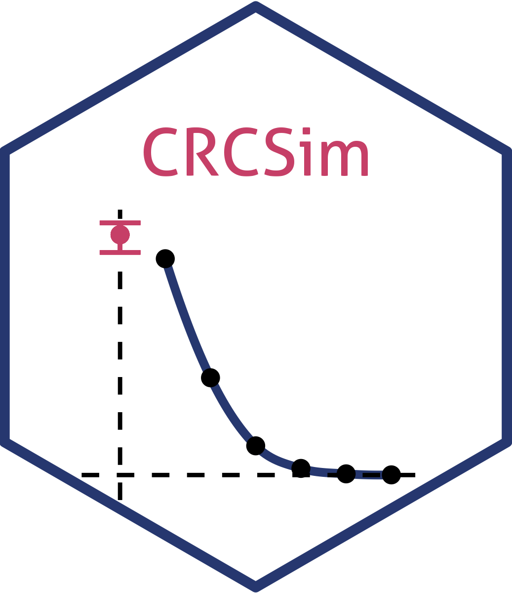

# Capture (Mark) Re-Capture - A Simulation Study
## Overview

To effectively tackle the overdose crisis, a nuanced understanding of Opioid Use Disorder (OUD) prevalence is crucial, both broadly and within targeted cohorts. Healthcare interactions provide estimates but may overlook those outside the healthcare system, leading to underestimation. Capture-recapture (CRC) analysis is valuable in estimating prevalence by addressing underreporting in surveillance. Conventionally, a stepwise model selection process (MSP) is employed to identify the model that best fits the data. However, the MSP in estimating group-stratified prevalence is less explored, especially with sparse data. This study uses simulations to investigate different MSPs for selecting conventional log-linear CRC models, with a focus on their ability to precisely estimate strata prevalence.

## Shiny Applet
While this package is not intended for publication on CRAN, we suspect there may be some who would want to test different MSPs on emulations of their own data. To this end, we have provided a [Shiny App](https://github.com/SyndemicsLab/CRCSim/blob/main/app.R) in the repository root. Clicking 'run' inside an RStudio instance installs the necessary packages [`Syndemics`](www.github.com/SyndemicsLab/Syndemics) and the package also located in this repository: [`CRCSim`](https://github.com/SyndemicsLab/CRCSim/tree/main/CRCSim)
